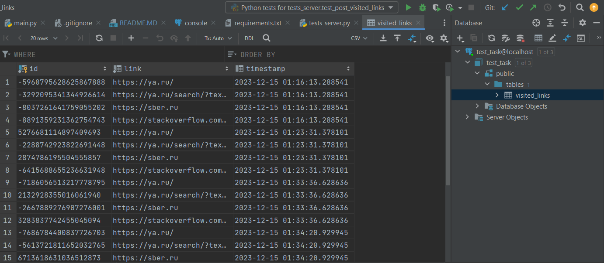

# Web-сервис для учета посещенных ресурсов

Этот веб-сервис разработан с использованием FastAPI и SQLAlchemy для простого учета посещенных работником ссылок.

## Технические требования

- Python 3
- FastAPI
- SQLAlchemy
- psycopg2
- pytest

## Запуск приложения

1. Установите зависимости:

    ```bash
    pip install -r requirements.txt
    ```

2. Запустите приложение:

    ```bash
    uvicorn main:app --reload
    ```

    Приложение будет доступно по адресу http://127.0.0.1:8000.

## API

### POST /visited_links

Этот эндпоинт принимает список посещенных ссылок и сохраняет их в базе данных.

**Пример запроса:**

```json
POST /visited_links

{
   "links": [
      "https://ya.ru/",
      "https://ya.ru/search/?text=мемы+с+котиками",
      "https://sber.ru",
      "https://stackoverflow.com/questions/65724760/how-it-is"
   ]	
}
```

**Пример ответ:**

```json
HTTP 200 OK

{
   "status": "ok"
}
```

### GET /visited_domains

Этот эндпоинт возвращает список уникальных посещенных доменов за указанный временной интервал.

**Пример запроса:**

```json
GET /visited_domains?from=0&to=1802593424
```

**Пример ответа:**

```json
HTTP 200 OK

{
   "domains": [
      "ya.ru",
      "sber.ru",
      "stackoverflow.com"
   ],
   "status": "ok"
}
```

## Запуск тестов

Запуск тестов можно осуществить с помощью команды:

```bash
pytest tests_server.py
```

## P.S.

Добавлю буквально пару слов от себя

1. Я намерено использовал какие-то допущения в программе, такие например как создание uuid и передача это как строкового параметра в бд (типо what? вообще, в постгре и вовсе есть встроенная функция gen_random_uuid()) чтобы для проверяющего было проще понять что я понимаю что делаю и как работает, а не задавался вопросом как у меня это работает где-то на другой стороне. Это касается и вписывание прямо в код связки usernam@password для бд. Разумеется в реальности я бы так делать не стал :)
2. Считаю уместным приложить ниже несколько материалов связанных с бд как доказательство что я действительно проделал эту работу и у меня даже лежат там данные :)

**Вид команды для создания таблицы:**

```sql
CREATE TABLE visited_links (
    id VARCHAR(36) PRIMARY KEY,
    link VARCHAR(255) NOT NULL,
    timestamp TIMESTAMP DEFAULT current_timestamp
);
```

**Фото с некоторыми данными в таблице:**



На этом вроде всё, спасибо за уделённое время :)